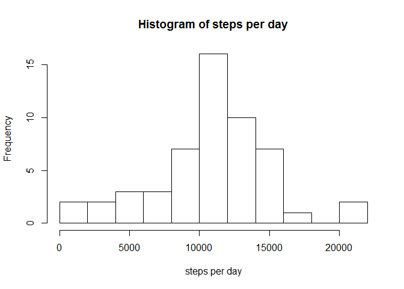
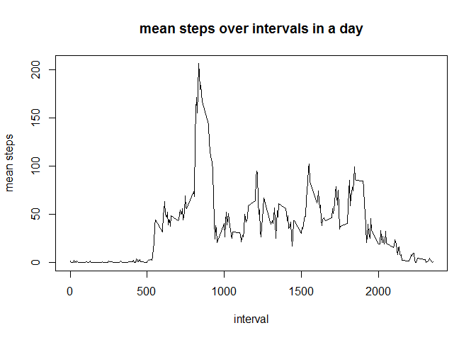
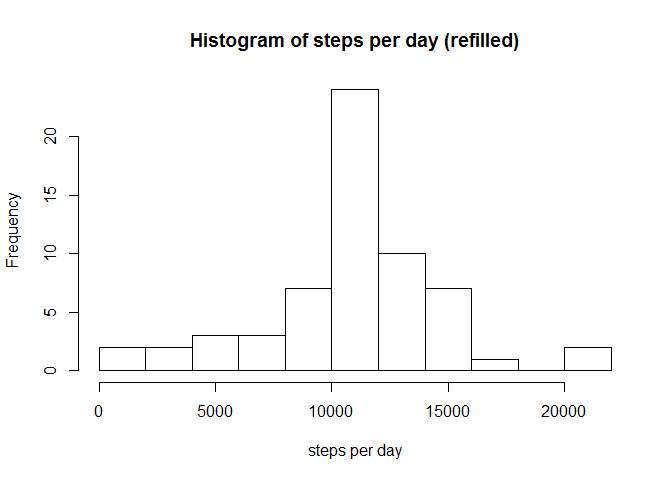

# Reproducible Research: Peer Assessment 1


## Loading and preprocessing the data
1.Load the data (i.e. `read.csv()`)  
2.Process/transform the data (if necessary) into a format suitable for your analysis  

```r
library(lattice)
unzip("./activity.zip")
df<-read.csv(file="activity.csv")
df$date<-as.Date(df$date,"%Y-%m-%d")
```

## What is mean total number of steps taken per day?
1. Make a histogram of the total number of steps taken each day  

```r
steps.day<-aggregate(steps~date,df,sum,na.rm=TRUE)
hist(steps.day$steps, breaks = 10, main = "Histogram of steps per day", xlab = "steps per day")
```

 

2. Calculate and report the mean and median total number of steps taken per day  

```r
mean(steps.day$steps)
```

```
## [1] 10766.19
```

```r
median(steps.day$steps)
```

```
## [1] 10765
```

## What is the average daily activity pattern?
1. Make a time series plot (i.e. `type = "l"`) of the 5-minute interval (x-axis) and the average number of steps taken, averaged across all days (y-axis)  

```r
steps.interval<-aggregate(steps~interval,df,mean,na.rm=TRUE)
plot(steps~interval,steps.interval,type = "l",main = "mean steps over intervals in a day", xlab = "interval", ylab = "mean steps")
```

 

2. Which 5-minute interval, on average across all the days in the dataset, contains the maximum number of steps?

The interval containing max steps

```r
steps.interval$interval[which.max(steps.interval$steps)]
```

```
## [1] 835
```

## Imputing missing values
1. Calculate and report the total number of missing values in the dataset (i.e. the total number of rows with `NA`s)  

Count the total number of `NA`s

```r
ifna<-is.na(df)
length(grep(TRUE,ifna))
```

```
## [1] 2304
```

Count the number of `NA`s in `steps`

```r
length(grep(TRUE,ifna[,1]))
```

```
## [1] 2304
```

The number of rows with at least one `NA` must be equal to the total number of `NA`s (since all `NA`s are in `steps` colomn)

2. Devise a strategy for filling in all of the missing values in the dataset. The strategy does not need to be sophisticated. For example, you could use the mean/median for that day, or the mean for that 5-minute interval, etc.  

Fill the missing values with the mean of interval. Part of the looking up table is

```r
head(steps.interval)
```

```
##   interval     steps
## 1        0 1.7169811
## 2        5 0.3396226
## 3       10 0.1320755
## 4       15 0.1509434
## 5       20 0.0754717
## 6       25 2.0943396
```

```r
tail(steps.interval)
```

```
##     interval     steps
## 283     2330 2.6037736
## 284     2335 4.6981132
## 285     2340 3.3018868
## 286     2345 0.6415094
## 287     2350 0.2264151
## 288     2355 1.0754717
```

3. Create a new dataset that is equal to the original dataset but with the missing data filled in.

```r
df.new<-df
index<-match(df$interval[is.na(df$steps)],steps.interval$interval)
df.new$steps[is.na(df$steps)]<-steps.interval$steps[index]
```

4. Make a histogram of the total number of steps taken each day and Calculate and report the mean and median total number of steps taken per day. Do these values differ from the estimates from the first part of the assignment? What is the impact of imputing missing data on the estimates of the total daily number of steps?

```r
steps.day.new<-aggregate(steps~date,df.new,sum)
hist(steps.day.new$steps, breaks = 10, main = "Histogram of steps per day (refilled)", xlab = "steps per day")
```

 


```r
mean(steps.day.new$steps)
```

```
## [1] 10766.19
```

```r
median(steps.day.new$steps)
```

```
## [1] 10766.19
```

The mean remains the same, but the median slightly increases.  

## Are there differences in activity patterns between weekdays and weekends?

1. Create a new factor variable in the dataset with two levels -- "weekday" and "weekend" indicating whether a given date is a weekday or weekend day.


```r
day<-0
day[weekdays(df$date) %in% c("Saturday", "Sunday")]<-"weekend"
day[!(weekdays(df$date) %in% c("Saturday", "Sunday"))]<-"weekday"
df.new$day<-as.factor(day)
```

2. Make a panel plot containing a time series plot (i.e. `type = "l"`) of the 5-minute interval (x-axis) and the average number of steps taken, averaged across all weekday days or weekend days (y-axis). 


```r
steps.interval.new<-aggregate(steps~interval+day,df.new,mean)
xyplot(steps~interval|day,steps.interval.new,type = "l",layout = c(1,2))
```

 
